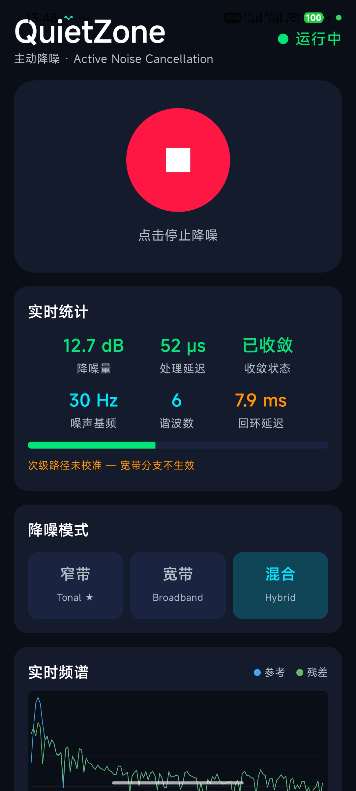
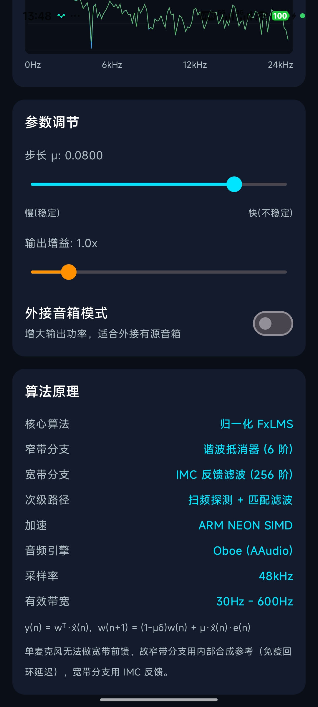

# QuietZone 🎧

Android 单麦克风主动降噪（Active Noise Cancellation, ANC）实验性应用，基于归一化 FxLMS 自适应滤波算法，使用 Oboe（AAudio）低延迟音频引擎与 ARM NEON 加速，全部 DSP 用 C++ 实现。

[](https://github.com/gyaoshi/anc2/actions/workflows/android.yml)

> ⚠️ **这是一个实验性项目，实际降噪效果不太好。** 请把它当作学习/研究用途的算法验证原型，而不是可日常使用的降噪产品。原因见下方[「为什么效果有限」](#为什么效果有限)。

## 功能

- **实时降噪**：通过手机麦克风拾取环境噪声，实时生成反相声波从扬声器输出抵消
- **三种降噪模式**
  - 窄带（Tonal）：谐波抵消器，针对风扇/引擎等稳定音调噪声
  - 宽带（Broadband）：IMC 反馈滤波，覆盖低频宽频噪声
  - 混合（Hybrid）：两者同时工作
- **实时统计面板**：降噪量（实测）、处理延迟、收敛状态、噪声基频、谐波数、回环延迟
- **实时频谱分析**：参考信号与残差信号频谱对比
- **参数调节**：自适应步长 μ、输出增益、外接音箱模式
- **次级路径校准**：扫频探测 + 匹配滤波，估计扬声器→麦克风的声学传递函数

| 主控界面 | 参数与算法 |
| --- | --- |
|  |  |

## 算法原理

```
y(n)   = wᵀ(n)·x(n)                       —— FxLMS 滤波输出
w(n+1) = (1-μδ)·w(n) + μ·x(n)·e(n)        —— 归一化 LMS 权重更新
```

- **核心算法**：归一化 FxLMS（256 阶自适应滤波器）
- **窄带分支**：谐波抵消器（默认 6 阶，容量 12），使用内部合成参考，不受回环延迟影响
- **宽带分支**：IMC 反馈滤波，使用估计扰动 d̂ = e − Ŝ·y
- **次级路径估计**：对数扫频探测 + 匹配滤波求脉冲响应
- **音频引擎**：Oboe 双独立流 + 弹性缓冲 + 时间扭曲漂移校正
- **加速**：ARM NEON SIMD，48 kHz 采样率，有效带宽 30 Hz – 600 Hz

## 为什么效果有限

单麦克风 ANC 存在物理层面的根本限制，本项目踩过的坑都写在 [评审报告](QuietZone_降噪逻辑评审报告.md) 里：

1. **宽带前馈不可行**——只有一个麦克风时，参考信号与误差信号是同一路，违反因果性（反噪声还没生成，噪声已经到了）
2. **回环延迟吃掉稳定裕度**——扬声器→麦克风的声学+缓冲延迟（实测 ~8 ms）限制了反馈分支的可用带宽与步长上限
3. **次级路径难以准确校准**——模型不准时谐波分支发散、宽带分支虚报降噪量
4. **扬声器低频滚降**——手机扬声器在低频段输出能力有限，恰好是最需要抵消的频段

目前真机实测在稳定音调噪声下有可感知的抵消效果，但宽带降噪量小、场景受限，离"好用"还有距离。

## 构建

需要 Android Studio / JDK 17 / Android SDK 34+：

```bash
./gradlew assembleDebug
```

推送后会自动触发 GitHub Actions：DSP 单元测试（g++）+ APK 构建，产物发布到 `latest` release。

## 项目结构

```
app/src/main/cpp/     C++ DSP 核心（FxLMS、谐波抵消器、次级路径、频谱分析）
app/src/main/java/    Kotlin UI 与服务（Compose 界面、前台服务、JNI 封装）
tests/                DSP 单元测试（桌面 g++ 运行）
sim/                  Python 仿真（步长稳定性扫描等）
```
